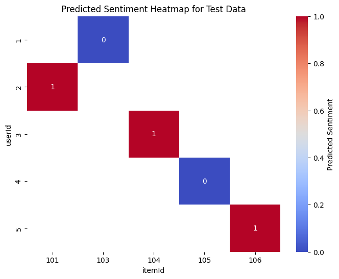
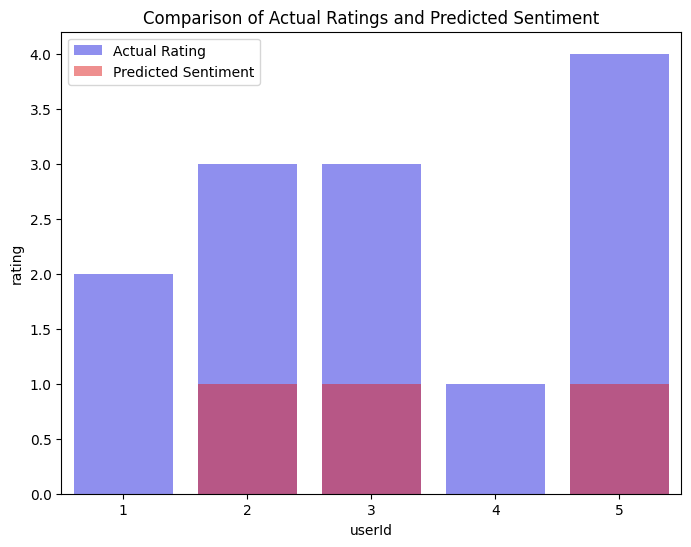

# Spark-Powered Personalised Finance Recommender with NLP

## Overview
This repository demonstrates a scalable, end-to-end machine learning pipeline built with **Apache Spark** to deliver personalised financial product recommendations and sentiment insights from customer reviews.

The project combines:
- **Collaborative filtering (ALS)** for user–item recommendations
- **Natural language processing (NLP)** for sentiment classification of review text

The full pipeline runs in **Google Colab**, making it easy to reproduce, adapt, and extend for learning or prototyping.

## Key Features

| Capability | Description |
|-----------|-------------|
| Scalable NLP | Spark ML pipeline for tokenisation, stop-word removal, TF-IDF feature extraction, and logistic regression sentiment classification |
| Collaborative Filtering | ALS-based personalised recommendation engine using explicit user ratings |
| Big-Data Ready | Built with PySpark pipelines, mirroring patterns used in large-scale production systems |
| Practical Application | Demonstrates how customer sentiment and ratings can jointly inform financial product recommendations |

## Technologies Used
- **PySpark** – Distributed data processing and ML pipelines  
- **Spark MLlib** – ALS collaborative filtering and pipeline APIs  
- **NLP Techniques** – Tokenisation, stop-word removal, TF-IDF, logistic regression  
- **Google Colab** – Reproducible cloud execution environment  
- **Python 3.11+**

## Repository Structure

```text
Spark-Powered-Personalised-Finance-Recommender-with-NLP/
├─ README.md                  # Project documentation
├─ SparkPowered-PersonalisedFinanceRecommender-withNLP.ipynb   # End-to-end Spark ML pipeline (Colab)
├─ finance_reviews.txt        # Raw user–item ratings and review text
```
## Dataset
The project uses a lightweight, CSV-style .txt file stored at the repository root:

```text
userId, itemId, rating, review_text
```
This format reflects how raw review data is often ingested in practice before being scaled to distributed storage (e.g. HDFS or object storage).

## Workflow Summary
The notebook walks through:
- Loading and parsing raw review data from a .txt file
- Building an NLP pipeline to classify review sentiment
- Training an ALS recommender model on user–item ratings
- Generating and comparing predicted sentiment and recommendation scores
- Interpreting outputs through tables and visualisations

## Example Outputs

### Sentiment Heatmap
This heatmap visualises predicted sentiment scores across user–item pairs, highlighting patterns in model interpretation of review text.



### Ratings vs Predicted Sentiment
This bar plot compares user-provided ratings with NLP-predicted sentiment, illustrating alignment between explicit ratings and textual feedback.




## Scaling Beyond the Demo
While the included dataset is intentionally small, the pipeline is designed to scale to real-world data sources, such as:
- Public review datasets (e.g. Amazon or Yelp reviews via Kaggle)
- Financial news or commentary APIs for sentiment analysis
- User interaction data from financial or banking applications
- Synthetic data generation to simulate large-scale user–item interactions
- Social platforms (e.g. Reddit or finance-focused forums) for opinion mining

## Educational Goals
This project is intended for:
- Data science learners exploring PySpark, NLP, and recommender systems
- Practitioners seeking a reproducible example of scalable ML workflows
- Portfolio demonstration of end-to-end ML thinking in a financial context

## Disclaimer
This project is for educational and demonstration purposes only.
It does not provide real financial advice and contains no personal data.

## License
This project is licensed under the **MIT License**. See the [LICENSE](LICENSE) file for details.

